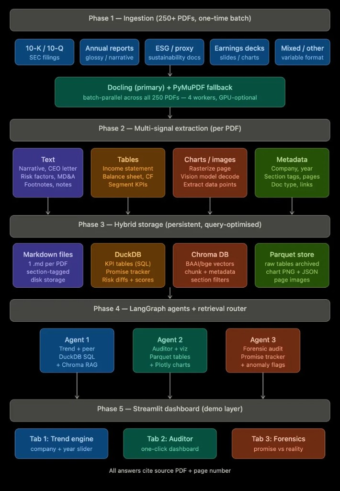
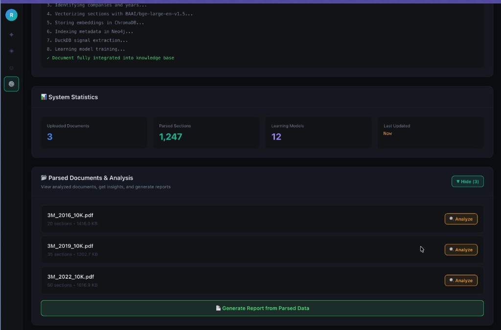
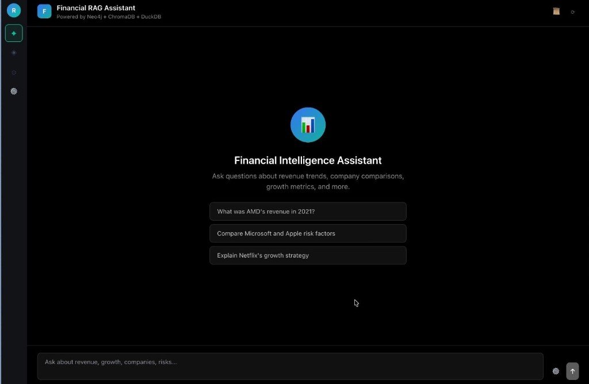
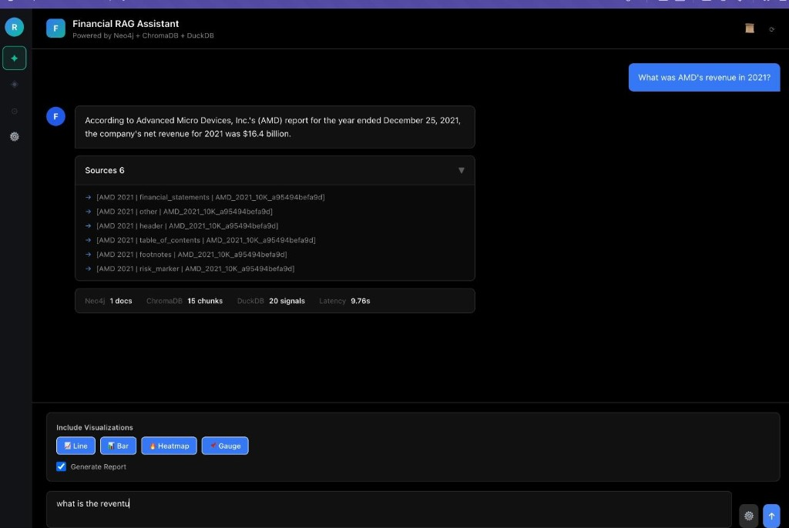
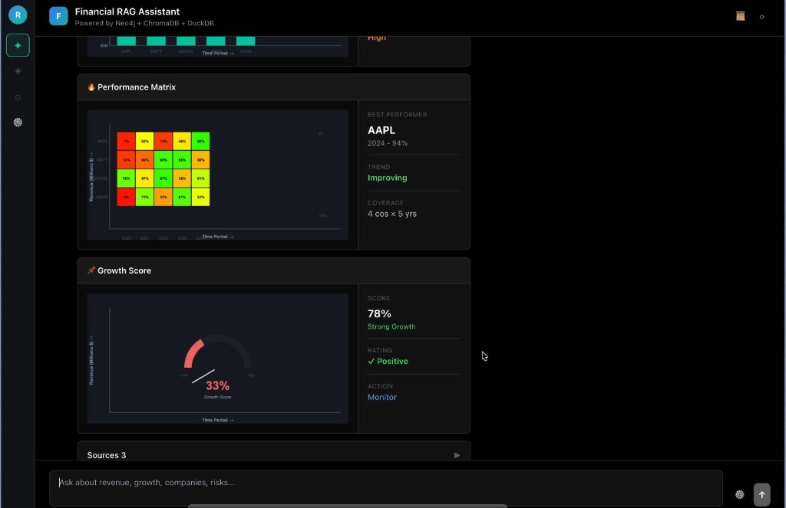
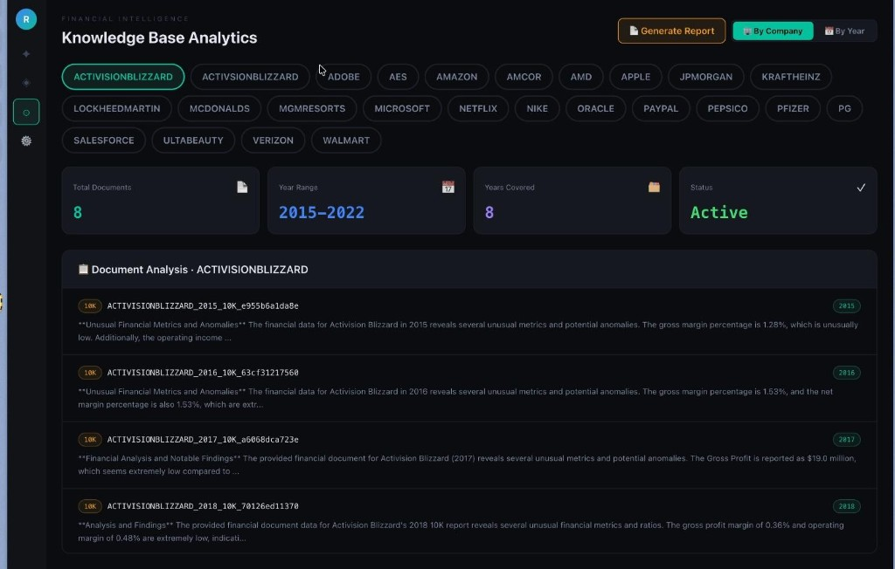
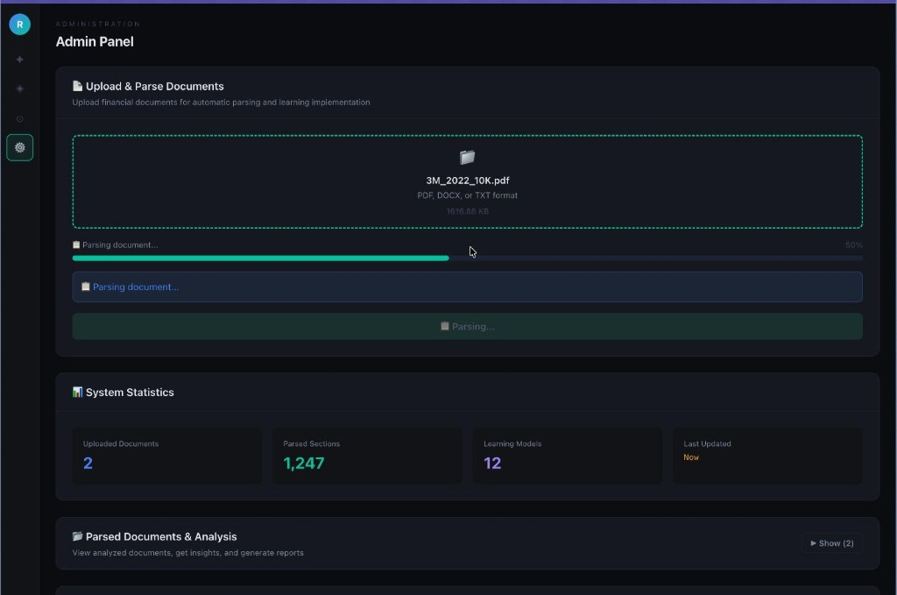
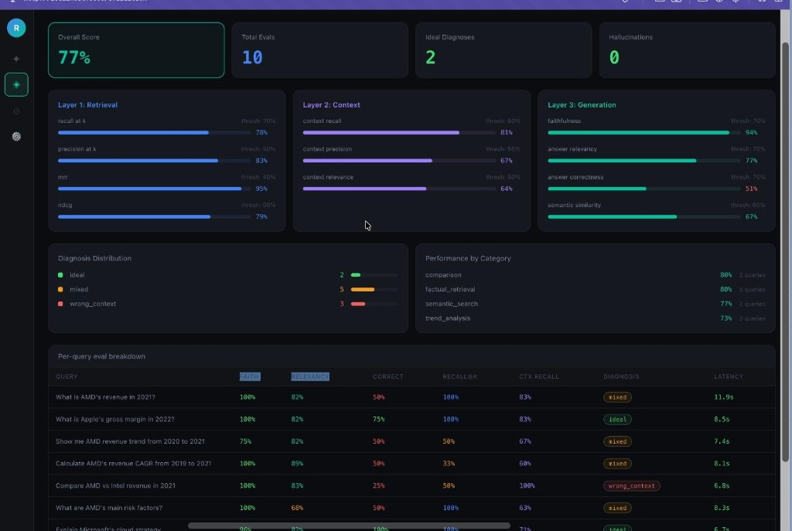

# Financial Intelligence Suite

A **Retrieval-Augmented Generation (RAG)** stack for financial documents: **extract → chunk & signal → index (Neo4j + ChromaDB + DuckDB)** → **Flask API** with **`smart_retriever`** → **React (Vite)** UI.

Take one or all three PDFs from your data folder, run through a three-phase pipeline (extract → chunk → index), then query via API or dashboard.

---

## Table of contents

- [Project Overview](#project-overview)
- [Key Features](#key-features)
- [Architecture](#architecture-overview)
- [What Each Phase Does](#what-each-phase-does)
- [Product UI](#product-ui-screenshots)
- [Phase 1 — Extraction](#phase-1-document-extraction--structuring)
- [Phase 2 — Chunking & signals](#phase-2-intelligent-chunking--signal-extraction)
- [Phase 3 — Indexing & retrieval](#phase-3-indexing--retrieval-layer-setup)
- [Agents & retrieval](#agents--smart-retrieval)
- [API (Flask)](#api-endpoints-flask)
- [Quick start](#quick-start)
- [Directory structure](#directory-structure)
- [Environment variables](#environment-variables)
- [Troubleshooting](#troubleshooting)

---

## Project Overview
Financial Intelligence Suite is a production-ready **Retrieval-Augmented Generation (RAG)** system designed specifically for financial documents (10-Ks, 10-Qs, annual reports, etc.). It processes PDF documents through a structured pipeline, extracts and indexes content across three specialized systems (Neo4j, ChromaDB, DuckDB), and exposes intelligent query and analytics capabilities through both a REST API and an interactive web dashboard.

**Core workflow:**
- Ingest PDFs → Extract structure, text, tables, charts → Classify sections and extract financial signals → Index into hybrid storage layers → Query with citations and retrieval metrics

The system is built for accuracy and citation: every answer cites the source document, section type, and retrieval confidence.

---

## Key Features

✅ **Multi-format PDF parsing** — text, tables, charts, metadata extraction with LiteParse and vision models  
✅ **Intelligent chunking** — hierarchical parent/child chunks with overlap, table-aware rules  
✅ **Financial signal extraction** — KPIs, risks, forward-looking statements, anomalies, sentiment  
✅ **Hybrid retrieval** — Neo4j metadata + ChromaDB semantic search + DuckDB numerical signals  
✅ **Citation-aware answers** — every response includes source filing, section, and relevance score  
✅ **REST API** — query, analytics, reporting, outlier detection  
✅ **React dashboard** — query interface, analytics views, admin uploads, evaluation metrics  
✅ **Knowledge enrichment** — optional LLM-driven extraction for deeper financial insights  
✅ **Evaluation tooling** — measure retrieval quality, generation quality, and context relevance

---

## What Each Phase Does

| Phase | Purpose | Entry point | Output |
|-------|---------|-------------|--------|
| **Phase 1** | Extract structure, text, tables, chart regions from PDFs | `python phase1/ingest.py` | `phase1_output/` |
| **Phase 2** | Chunk, classify sections, extract financial signals | `python phase2/process.py` | `phase2_output/` |
| **Phase 3** | Index into Neo4j, ChromaDB, DuckDB for retrieval | `python phase3/setup.py` | Populated databases |
| **API** | REST endpoints for queries, stats, reports, evals | `python api_server.py` | JSON responses on :5001 |
| **Frontend** | Interactive UI for querying and analytics | `npm run dev` (in `frontend/`) | Web app on :3000 |

---

## Architecture overview

```
┌─────────────────────────────────────────────────────────────┐
│              Frontend (React + Vite)                        │
│     Query · Analytics · Admin · Knowledge base views        │
└──────────────────────────┬──────────────────────────────────┘
                           ↓ HTTP
┌─────────────────────────────────────────────────────────────┐
│         Flask API — api_server.py (port 5001)               │
│  /api/query · /api/evals · /api/stats · /api/report         │
│  /api/outliers/* · /api/documents/* · /api/graph/* …        │
└──────────────────────────┬──────────────────────────────────┘
                           ↓
┌─────────────────────────────────────────────────────────────┐
│              Processing pipeline                             │
│         Phase 1 → Phase 2 → Phase 3                         │
│         Extract    Chunk      Index & embed                 │
└──────────────────────────┬──────────────────────────────────┘
                           ↓
┌─────────────────────────────────────────────────────────────┐
│           Data & indexing layer                             │
│  ┌──────────────┬──────────────┬──────────────┐             │
│  │    Neo4j     │  ChromaDB    │   DuckDB     │             │
│  │  (metadata   │  (vectors)   │  (metrics & │             │
│  │   & graph)   │  bge-large   │   signals)   │             │
│  └──────────────┴──────────────┴──────────────┘             │
└─────────────────────────────────────────────────────────────┘
```

**Five-phase product view** (batch ingestion → multi-signal extraction → hybrid storage → agents → UI):



Design goal: answers cite **source filing + section/page** where metadata allows.

---

## Product UI screenshots

### Ingestion pipeline (vectorize → ChromaDB → Neo4j → DuckDB)



### Financial RAG assistant (Neo4j + ChromaDB + DuckDB)







### Knowledge base analytics



### Admin — upload & parse



### Evaluation dashboard (layered RAG metrics)



---

## Phase 1: Document extraction & structuring

**Goal:** Transform raw PDFs (10-K, 10-Q, annual reports, ESG disclosures) into structured, queryable artifacts that preserve layout, semantics, and financial context.

### What it does

- **Parse PDFs** with layout awareness (preserving sections, tables, hierarchy)
- **Extract text** as Markdown with section boundaries and page references
- **Normalize tables** as JSON rows + SQL-friendly schemas + natural-language descriptions
- **Interpret charts** using vision LLMs (exact numbers, series, labels)
- **Classify sections** into canonical financial types (Risk, MD&A, Financials, Footnotes, etc.)
- **Extract metadata** (company, fiscal year, document type, filing date, pages)
- **Extract KPIs** from tables (revenue, expenses, margins, key metrics)
- **Validate outputs** and produce quality reports

### Technologies

| Component | Details | Purpose |
|-----------|---------|---------|
| **LiteParse** | `lit parse file.pdf` via CLI | Layout-aware extraction; preserves structure + tables |
| **Fallback parsers** | PyMuPDF, pdfplumber, camelot | Used if LiteParse fails |
| **Vision APIs** | Gemini 2.0 / Groq vision | Chart images → structured data |
| **Section detection** | Regex + heuristics | Maps Item 1, Item 7, etc. → canonical types |
| **Table normalization** | Pandas + custom logic | Cells → rows + descriptions + statements |

### How to run

**Single document:**
```bash
python phase1/ingest.py --pdf uploads/AMD_2021_10K.pdf --company AMD --year 2021
```

**Batch processing:**
```bash
python phase1/ingest.py --batch uploads/
```

**With company only (auto-detect year):**
```bash
python phase1/ingest.py --pdf uploads/file.pdf --company MSFT
```

### Output structure

All outputs go to `phase1_output/`:
- `normalized_json/` — complete document with all extracted fields
- `raw_markdown/` — layout-aware text output from LiteParse
- `metadata/` — company, year, type, filing date, section map
- `tables/` — normalized rows + descriptions + KPI mappings
- `charts/` — vision-decoded structured data (series, title, labels)
- `validation_report/` — completeness, data quality, warnings

### Key modules

| Module | File | Responsibility |
|--------|------|-----------------|
| **Orchestrator** | `ingest.py` | CLI entry point, coordinates all steps |
| **LiteParse integration** | `liteparse_integration.py` | Invokes `lit parse`, parses Markdown output |
| **Fallback PDF parsing** | `parsers.py` | PyMuPDF, pdfplumber, camelot fallbacks |
| **TOC extraction** | `toc_parser.py` | Extracts outline and section boundaries |
| **Document structure** | `document_structure.py` | Recognizes financial section patterns |
| **Table parsing** | `table_parser.py` | Normalizes cells → rows → descriptions |
| **Chart extraction** | `chart_extractor_enhanced.py` | Extracts chart images → calls vision API |
| **Metadata extraction** | `classifier.py` | Company, year, doc type, filing date |
| **KPI extraction** | `kpi_extractor.py` | Identifies KPIs from tables/text |
| **Validation** | `validator.py` | Quality checks and reports |
| **Configuration** | `config.py` | Paths, thresholds, model choices |


---

## Phase 2: Intelligent chunking & signal extraction

**Goal:** Classify sections/tables, build **hierarchical chunks**, extract **signals** for analytics and DuckDB.

### What it does

- Reads JSON from `phase1_output/`
- Classifies sections (risk factors, MD&A, financial statements, etc.)
- Builds hierarchical chunks (parent text + child semantic chunks)
- Extracts financial signals: KPIs, metrics, risks, forward-looking statements, anomalies, sentiment
- Routes tables: SQL-oriented (for DuckDB) vs semantic (for ChromaDB)
- Outputs classified chunks and signals to `phase2_output/`

### How to run

```bash
# Process all phase1_output
python phase2/process.py

# Process with specific company filter
python phase2/process.py --company AMD

# Process with year filter
python phase2/process.py --years 2021,2022,2023
```

### Output

Produces `phase2_output/` with:
- `by_company/` — chunks and signals grouped by company
- `by_year/` — chunks and signals grouped by filing year
- `signals/` — extracted KPIs, risks, promises, anomalies
- `classified_sections/` — section types for each chunk

### Technologies

sentence-transformers (via Phase 3 embedding), pandas/numpy, NLTK-style utilities as configured in `phase2/config.py`.

### Key modules

| Module | Role |
|--------|------|
| `process.py` | Orchestrator |
| `chunker.py` | Parent/child chunks, overlap, table-aware rules |
| `section_classifier.py` | Section types (e.g. risk, MD&A, financials) |
| `table_classifier.py` | Routes tables toward SQL vs vector descriptions |
| `signal_extractor.py` | Numeric / categorical signals |
| `config.py` | Paths, token sizes |

---

## Phase 3: Indexing & retrieval layer setup

**Goal:** Load chunks and metrics into **Neo4j** (graph metadata), **DuckDB** (structured facts & signals), **ChromaDB** ( **BAAI/bge-large-en-v1.5** , **1024-dim** embeddings).

### What it does

- Loads `phase2_output/` into three specialized databases:
  - **Neo4j**: company → document → section graph (metadata, relationships)
  - **ChromaDB**: chunks → BAAI/bge-large embeddings (semantic search)
  - **DuckDB**: structured tables for signals, metrics, KPIs
- Creates optimized schema in each database
- Embeds all text chunks for semantic similarity
- Provides unified retrieval interface used by Flask API

### How to run

```bash
# Full indexing pipeline
python phase3/setup.py

# Setup only Neo4j
python phase3/neo4j_setup.py

# Setup only ChromaDB
python phase3/chromadb_setup.py

# Setup only DuckDB
python phase3/duckdb_setup.py

# Incremental embedding updates
python phase3/embed_incremental.py
```

### Retrieval modes

Once indexed, the system supports:

1. **Structured / analytical** → DuckDB  
   SQL queries for financial metrics, signals, tables

2. **Semantic** → ChromaDB  
   Vector similarity search for NLP understanding

3. **Metadata / traversal** → Neo4j  
   Graph traversal for company/document/section relationships

4. **Hybrid** → Combined ranking (see `agents/smart_retriever.py`)  
   Uses all three optimally for answering financial questions

### Technologies

DuckDB (SQL), ChromaDB + BAAI/bge-large-en-v1.5 (embeddings), Neo4j (graph database)

### Key modules

| Module | Role |
|--------|------|
| `setup.py` | Runs Neo4j → DuckDB → ChromaDB |
| `neo4j_setup.py` | Graph schema & loads |
| `duckdb_setup.py` | SQL tables |
| `chromadb_setup.py` | Collections + embeddings |
| `embed_incremental.py` | Incremental embedding updates |
| `query_router.py` | Structured vs semantic vs hybrid routing |
| `retrieval.py` | Unified retrieval helpers |
| `config.py` | DB paths, model id, collection names |

---

## Agents & smart retrieval

### Smart Retriever (Used by Flask API)

Entry point: `agents/smart_retriever.py`

What it does:
- Parses user query to extract companies, years, topics
- Uses Neo4j to find matching documents and sections
- Uses ChromaDB for semantic chunk similarity
- Uses DuckDB for numerical signals and tables
- Returns ranked results with citations
- Used internally by `/api/query` endpoint

Run standalone:
```bash
python agents/smart_retriever.py "What was AMD's revenue in 2021?"
```

---

## API endpoints (Flask)

Primary server: **`python api_server.py`** → **http://localhost:5001**

| Method | Path | Purpose |
|--------|------|---------|
| POST | `/api/query` | RAG query + answer + sources + stats |
| GET | `/api/evals` | Evaluation summaries |
| GET | `/api/stats` | DB / system stats |
| GET | `/api/outliers/company`, `/api/outliers/year` | Anomaly summaries |
| POST | `/api/report` | Generated report |
| POST | `/api/documents/upload` | Upload PDF |
| … | `/api/documents/*`, `/api/graph/*`, `/api/kb/search`, … | Documents, graph, KB search |

### API Examples (curl)

**Health check:**
```bash
curl -s http://localhost:5001/api/health
```
Expected response: `{"status":"ok"}`

**Run a query:**
```bash
curl -s -X POST http://localhost:5001/api/query \
  -H "Content-Type: application/json" \
  -d '{"query":"What was Microsoft revenue in 2023?"}'
```
Response includes: answer, sources, citations, companies, years, sections, stats (latency, doc count, chunk count)

**Get system statistics:**
```bash
curl -s http://localhost:5001/api/stats
```
Response includes: Neo4j node counts, ChromaDB collection sizes, DuckDB table counts

**Get company-level outliers:**
```bash
curl -s http://localhost:5001/api/outliers/company
```
Response: JSON array of anomalies grouped by company

**Get year-level outliers:**
```bash
curl -s http://localhost:5001/api/outliers/year
```
Response: JSON array of anomalies grouped by year

**Get evaluation metrics:**
```bash
curl -s http://localhost:5001/api/evals
```
Response: latest eval results, trend snapshots

**Generate a filtered report:**
```bash
curl -s -X POST http://localhost:5001/api/report \
  -H "Content-Type: application/json" \
  -d '{"company":"AMD","year":2021}'
```
Response: LLM-generated markdown report for the specified company and year

Example:
```bash
curl -s -X POST http://localhost:5001/api/query \
  -H "Content-Type: application/json" \
  -d '{"query": "What was Microsoft revenue in 2023?"}'
```

---

## Quick start

### Input & Output Structure

**Where to put PDFs:**
```
uploads/
├── AMD_2021_10K.pdf
├── AMD_2022_10K.pdf
├── MSFT_2023_10K.pdf
└── ... (any SEC filings)
```

**Output folders** (created automatically):
- `phase1_output/` — normalized JSON, tables, charts from extraction
- `phase2_output/` — chunks, signals, classified sections
- `data/chromadb/` — vector embeddings
- `data/duckdb/` — SQL tables and signals
- `knowledge_output/` — (optional) enriched financial signals

**Naming convention:** One PDF → one `doc_id` (e.g., `AMD_2021_10K` + hash). Keep `--company` and `--year` consistent across all phases.

---

### Prerequisites

- Python **3.10+** recommended  
- **Node.js 16+** + **LiteParse**: `npm install -g @llamaindex/liteparse`  
- **Neo4j** running (align credentials with `.env`)
- **API Keys**: `GROQ_API_KEY`, `GEMINI_API_KEY` in `.env`

### Step 1: Install dependencies

```bash
# Python backend
pip install -r requirements.txt

# Frontend
cd frontend && npm install && cd ..
```

### Step 2: Configure environment

Create a `.env` file in the project root:
```env
GROQ_API_KEY=your_key_here
GEMINI_API_KEY=your_key_here
NEO4J_URI=neo4j://127.0.0.1:7687
NEO4J_USER=neo4j
NEO4J_PASSWORD=your_password
NEO4J_DATABASE=hyperverge-base
```

### Step 3: Run the pipeline (one-time setup)

**Option A: Step-by-step (recommended for first run)**

```bash
# Phase 1: Extract single PDF
python phase1/ingest.py --pdf uploads/AMD_2021_10K.pdf --company AMD --year 2021

# Phase 1: Or batch process all PDFs
python phase1/ingest.py --batch uploads/

# Phase 2: Chunk and extract signals (processes all phase1_output/)
python phase2/process.py

# Phase 3: Index into Neo4j, ChromaDB, DuckDB
python phase3/setup.py

# Optional: Inspect what was indexed
python tools/view_duckdb.py
python tools/view_chromadb.py
```

**Option B: Automated (one command)**

```bash
./run_complete_system.sh uploads/AMD_2021_10K.pdf AMD 2021
```

This runs all phases in sequence and smoke-tests the system.

**Phase 1 options:**
```bash
# Single file with explicit metadata
python phase1/ingest.py --pdf uploads/AMD_2021_10K.pdf --company AMD --year 2021

# Batch directory
python phase1/ingest.py --batch uploads/

# Batch specific files
python phase1/ingest.py --batch uploads/AMD_2021_10K.pdf uploads/MSFT_2023_10K.pdf
```

**Phase 2 options:**
```bash
# Process all
python phase2/process.py

# Filter by company
python phase2/process.py --company AMD

# Filter by years
python phase2/process.py --years 2021,2022,2023
```

**Phase 3 options:**
```bash
# Full pipeline (Neo4j → DuckDB → ChromaDB)
python phase3/setup.py

# Or run individually
python phase3/neo4j_setup.py     # Graph indexing
python phase3/duckdb_setup.py    # SQL tables
python phase3/chromadb_setup.py  # Vector embeddings
```

**Optional: Knowledge base enrichment** (run after Phase 1)
```bash
# Extract KPIs, risks, sentiment, anomalies
python knowledge_base/process.py --input phase1_output/

# Or company/year filtered
python knowledge_base/process.py --company AMD --years 2021,2022

# Parallel batch processing (faster)
./run_parallel_processing.sh
```

### Step 4: Start the application

**Terminal 1 — Backend API:**
```bash
source hyperverge/bin/activate   # if using bundled venv
python api_server.py             # runs on :5001
```

**Terminal 2 — Frontend UI:**
```bash
cd frontend && npm run dev        # runs on :3000
```

Or start both together:
```bash
./start_dashboard.sh
```

### Step 5: Use the application

- **Web UI**: Open http://localhost:3000
- **Direct API**: `curl -X POST http://localhost:5001/api/query -H "Content-Type: application/json" -d '{"query":"your question here"}'`

---

### Full pipeline in detail

**Process a single PDF:**
```bash
python phase1/ingest.py --pdf uploads/BoundaryFile.pdf --company COMPANY --year 2024
python phase2/process.py
python phase3/setup.py
```

**Process multiple PDFs:**
```bash
python phase1/ingest.py --batch uploads/
python phase2/process.py
python phase3/setup.py
```

**Run evaluation:**
```bash
cd evals && python run_evals.py
```

### Optional: Knowledge enrichment

Extract additional financial signals for enhanced queries:
```bash
python knowledge_base/process.py --input phase1_output/
python knowledge_base/test_query.py --company AMD
```

---

## Directory structure

```
.
├── phase1/                 # Ingestion & parsing
├── phase2/                 # Chunking & signals
├── phase3/                 # DuckDB, ChromaDB, Neo4j setup; routing & retrieval
├── knowledge_base/         # Optional LLM knowledge extraction
├── agents/                 # smart_retriever (hybrid Neo4j+ChromaDB+DuckDB retrieval)
├── evals/                  # Evaluation metrics and ground truth
├── frontend/               # React + Vite
├── data/
│   ├── duckdb/
│   └── chromadb/
├── docs/assets/            # Architecture diagrams
├── api_server.py           # Main Flask API (:5001)
```

---

## Environment variables

Typical `.env` entries (names may vary slightly by module):

```env
GROQ_API_KEY=
GEMINI_API_KEY=

NEO4J_URI=neo4j://127.0.0.1:7687
NEO4J_USER=neo4j
NEO4J_PASSWORD=
NEO4J_DATABASE=

# Paths are often under data/ — see phase3/config.py
```

Do **not** commit real secrets.

---

## Tech stack summary

| Layer | Technology |
|-------|------------|
| UI | React 18, Vite, TypeScript |
| API | Flask, CORS, `api_server.py` |
| LLM | Groq / Gemini (config-dependent) |
| Embeddings | `BAAI/bge-large-en-v1.5` → ChromaDB |
| SQL | DuckDB |
| Graph | Neo4j |
| Retrieval | LangChain tools (Neo4j + ChromaDB + DuckDB) |

---

## Troubleshooting

### Common Issues and Solutions

| Issue | Symptoms | What to try |
|-------|----------|------------|
| **Neo4j connection errors** | API 500 on `/api/query` with neo4j errors | Start Neo4j; verify `NEO4J_*` in `.env`; test with `python phase3/test_neo4j_connection.py` if available |
| **Empty ChromaDB** | Query returns no results or stale results | Run `python phase3/setup.py` after ensuring `phase2_output/` exists |
| **ChromaDB schema mismatch** | API 500 with "no such column: collections.topic" | Rebuild: backup `data/chromadb/` then run `python phase3/chromadb_setup.py` |
| **LiteParse not found** | `lit parse` command not found during Phase 1 | `npm install -g @llamaindex/liteparse` |
| **API 500 on `/api/query`** | Blank error or timeout | Check Flask terminal for stack trace; verify all `.env` keys are set |
| **Frontend unstyled (no colors/layout)** | Page appears as plain text | Run `npm install && npm run build` in `frontend/` to rebuild Tailwind CSS |
| **Slow `/api/query` response** | First query takes 30+ seconds | Normal: embedding model is loading on first request; subsequent queries are faster |
| **Stale or incorrect answers** | Answers reference old data | Re-ingest PDFs with correct `--company` / `--year`, then re-run Phase 2–3 |
| **Port 3000 or 5001 already in use** | `Address already in use` error | `lsof -i :3000` (MacOS/Linux) or `netstat -ano` (Windows); `kill -9 <PID>` |
| **Missing dependencies** | `ModuleNotFoundError` on import | `pip install -r requirements.txt` |

### Verification Checklist

- [ ] `.env` has GROQ_API_KEY, GEMINI_API_KEY, NEO4J_*
- [ ] Neo4j is running (test: `curl http://localhost:7687`)
- [ ] Phase 1 completed: `phase1_output/` exists with JSON files
- [ ] Phase 2 completed: `phase2_output/` exists with chunks and signals
- [ ] Phase 3 completed: `data/chromadb/`, `data/duckdb/` populated
- [ ] Backend started: `python api_server.py` shows no errors
- [ ] Frontend started: `npm run dev` in `frontend/` shows "VITE ready"
- [ ] Health check: `curl http://localhost:5001/api/health` returns `{"status":"ok"}`
- [ ] Test query: `curl -X POST http://localhost:5001/api/query -H "Content-Type: application/json" -d '{"query":"test"}'` returns result

### Debug Mode

Check what the backend is doing:

```bash
# Watch API logs in real-time
python api_server.py

# In another terminal, send test query to see detailed logs
curl -s -X POST http://localhost:5001/api/query \
  -H "Content-Type: application/json" \
  -d '{"query":"AMD revenue 2021"}'
```

View frontend network requests (browser DevTools → Network tab) to see what the API is returning.

### Full Reset (if things are broken)

```bash
# 1. Stop Flask and Vite
# (Ctrl+C in both terminals)

# 2. Clear databases
rm -rf data/chromadb data/duckdb/*.db

# 3. Reimport a sample PDF
python phase1/ingest.py --pdf uploads/sample.pdf --company AMD --year 2021

# 4. Reprocess
python phase2/process.py
python phase3/setup.py

# 5. Restart
python api_server.py  # Terminal 1
cd frontend && npm run dev  # Terminal 2

# 6. Test
curl -X POST http://localhost:5001/api/query \
  -H "Content-Type: application/json" \
  -d '{"query":"test"}'
```

---

## Typical workflow

### For a new analyst

1. **Get your first document indexed** (5-10 minutes)
   ```bash
   # Step 1: Extract
   python phase1/ingest.py --pdf ~/Downloads/MSFT_2023_10K.pdf --company MSFT --year 2023
   
   # Step 2: Chunk and extract signals
   python phase2/process.py
   
   # Step 3: Index into databases
   python phase3/setup.py
   ```

2. **Start the application** (2 terminals)
   ```bash
   # Terminal 1: Backend
   python api_server.py
   
   # Terminal 2: Frontend
   cd frontend && npm run dev
   ```

3. **Open the dashboard**
   - http://localhost:3000 → Query Dashboard
   - Ask: "What was MSFT's revenue growth in 2023?"
   - See: answer + sources + retrieval stats

### For bulk processing

1. **Prepare folder with PDFs** → `uploads/`
   ```bash
   ls uploads/
   # AMD_2021_10K.pdf  MSFT_2023_10K.pdf  AAPL_2022_10K.pdf ...
   ```

2. **Run automated pipeline**
   ```bash
   ./run_complete_system.sh uploads/ auto auto
   ```

3. **Or process step-by-step**
   ```bash
   # Phase 1: Extract all
   python phase1/ingest.py --batch uploads/
   
   # Phase 2: Chunk all
   python phase2/process.py
   
   # Phase 3: Index everything
   python phase3/setup.py
   ```

### For evaluation & continuous improvement

1. **Run evaluations**
   ```bash
   cd evals && python run_evals.py
   ```
   
   Measures **retrieval precision/recall**, **context relevance**, and **generation quality** against ground truth.

2. **Interpret metrics**: retrieval accuracy, context relevance, answer quality across all three evaluation layers

3. **Review results**:
   - **logs/** — Daily feedback logs with per-query scores (JSONL)
   - **results/** — Evaluation run summaries with improvement recommendations

---

## Optional advanced features

### Knowledge Base Enrichment

Extract deeper financial signals for richer context and analytics.

**What it extracts:**
- **KPIs** — Revenue, margins, growth rates, debt ratios, cash flow metrics (time-series capable)
- **Risks** — Legal, operational, financial, and market risks with context
- **Forward-looking statements** — Management plans, growth targets, strategic initiatives
- **Anomalies** — Unusual YoY changes and data outliers
- **Sentiment** — Tone and confidence signals in management discussion

**Run after Phase 1:**
```bash
python knowledge_base/process.py --input phase1_output/
python knowledge_base/process.py --company AMD  # filter by company
```

**Query the knowledge base:**
```bash
python knowledge_base/test_query.py --company AMD
python knowledge_base/test_query.py --query "What were AMD's growth drivers?"
```

**Output structure:**
- `per_pdf/` — Signals per document (one 10-K/10-Q)
- `per_company/` — Aggregated per company per year (trends vs prior year)
- `per_year/` — Time-series across all companies
- `master/` — Cross-company comparisons (e.g., revenue FAANG 2018–2024)

**Integration:** Knowledge base outputs are automatically picked up by Phase 3 indexing into DuckDB/ChromaDB/Neo4j.

### Evaluation & Quality Metrics

Measure RAG quality across three layers: **retrieval**, **context**, **generation**.

**Three-layer evaluation:**

| Layer | Metrics | Purpose |
|-------|---------|---------|
| **Retrieval** | Recall@K, Precision@K, MRR, nDCG | Did we find the right documents? |
| **Context** | Context Recall, Precision, Relevance | Is retrieved text actually useful? |
| **Generation** | Faithfulness, Answer Relevancy, Correctness | Is the final answer correct & faithful? |

**Run evaluations:**
```bash
cd evals && python run_evals.py
```

**Results and logs:**
- `logs/` — Daily feedback (JSONL format with per-query scores)
- `results/` — Run summaries with bottleneck analysis
- `config.py` — Threshold tuning and metric weights

**Ground truth:**
Provide test queries + expected answers in `evals/ground_truth/queries.json`:
```json
{
  "query": "What was AMD's revenue in 2022?",
  "expected_answer": "$23.6 billion",
  "doc_ids": ["AMD_2022_10K"]
}
```

---

## Detailed phase documentation

For deeper technical details on each phase, see the dedicated README files:

| Phase | README | Focus |
|-------|--------|-------|
| **Phase 1** | [phase1/README.md](phase1/README.md) | PDF parsing, LiteParse integration, table/chart extraction, metadata |
| **Phase 2** | [phase2/README.md](phase2/README.md) | Hierarchical chunking, section classification, signal extraction |
| **Phase 3** | [phase3/README.md](phase3/README.md) | Neo4j/DuckDB/ChromaDB indexing, embeddings, hybrid retrieval |
| **Knowledge Base** | [knowledge_base/README.md](knowledge_base/README.md) | KPI/risk/sentiment extraction, per-company aggregation, synthesis |
| **Agents** | [agents/README.md](agents/README.md) | Smart retriever architecture, Neo4j/ChromaDB/DuckDB routing |
| **Evals** | [evals/README.md](evals/README.md) | 3-layer evaluation (retrieval, context, generation), ground truth |

Each README contains:
- Detailed walkthrough of what the phase does
- Technology stack for that phase
- Configuration options
- Advanced usage patterns
- Troubleshooting specific to that phase


